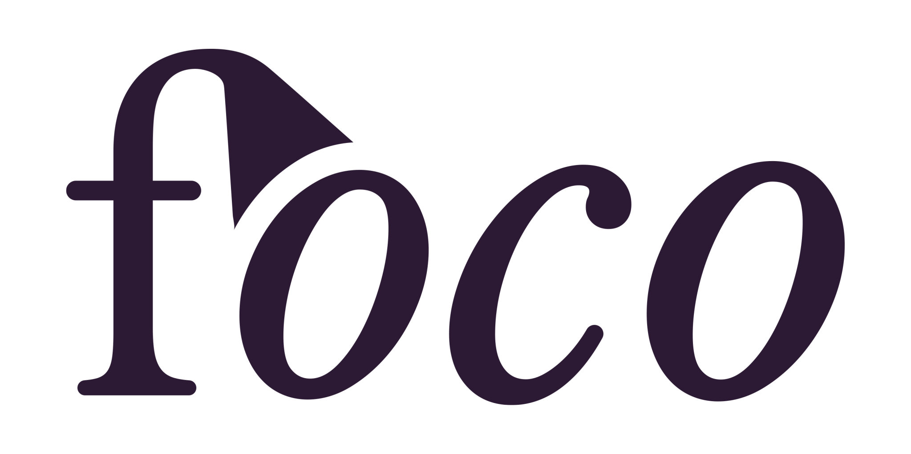

# foco

  
  

Minimalist text editor for writing without distractions for Android. This application can be considered as a professional writing application without distractions and fuss, since it has many useful features, or also as a simple notes application, because it is easy to use and tiny.

## Features

* Scrolling bar like completion bar

* Folder support
* Markdown format
* Writing statistics (time, words and chars count)
* Ambient music
* Undo and Redo
* Google Drive integration
* Focus current paragraph/line
* Dictionary
* Starred files
* Import and Export
* Search
* Dark mode
* Right to left support
* Tiny and battery friendly application
* Daily goals
* Timers and alarms
* Keyboard shortcuts
* Secret files (file encryption)
* Starred files widget

### Markdown format support
* H1, H2 and H3
* Bold, italic, underlined and strikethrough
* Quote
* List

## Mockup

  

## TODO
* Mockup application
* Define tasks and sprints

## 3rd party software

* [Realm](https://realm.io/)
* [Butter Knife](http://jakewharton.github.io/butterknife/)
* [MaterialSearchBar](https://github.com/mancj/MaterialSearchBar)
* [Timber](https://github.com/JakeWharton/timber)

## License

[GNU General Public License v3](https://www.gnu.org/licenses/gpl-3.0.en.html "GNU General Public License v3")

